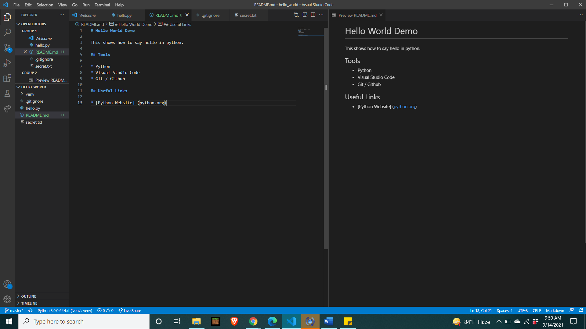

# Overview

This shows how to say Hello World in python.

This is for the purpose of demonstrating how to create repositories for GitHub.

The following video is my overview of this project.

[Creating My Hello World Repository](https://youtu.be/T-61Evoy65E)

# Development Environment

* Python
* Visual Studio Code
* Git / GitHub

# Useful Websites

{Make a list of websites that you found helpful in this project}
* [Python Website](http://www.python.org)
* [GitHub](http://www.github.com)

